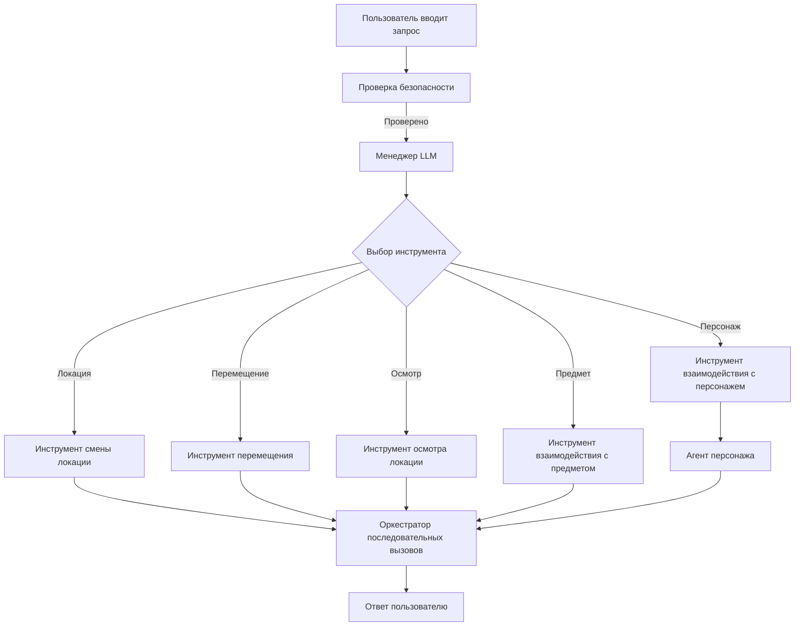

# llm_toolkit-lightrag
Combinations of LLM tools with LightRAG and system hosting

```mermaid
flowchart TD
    A[Пользователь вводит запрос]
    B[Проверка безопасности]
    C[Менеджер LLM]
    D{Выбор инструмента}
    E[Инструмент смены локации]
    F[Инструмент перемещения]
    G[Инструмент осмотра локации]
    H[Инструмент взаимодействия с предметом]
    I[Инструмент взаимодействия с персонажем]
    J[Агент персонажа]
    K[Оркестратор последовательных вызовов]
    L[Ответ пользователю]

    A --> B
    B -- Проверено --> C
    C --> D
    D -- "Локация" --> E
    D -- "Перемещение" --> F
    D -- "Осмотр" --> G
    D -- "Предмет" --> H
    D -- "Персонаж" --> I
    I --> J
    E & F & G & H & J --> K
    K --> L
```