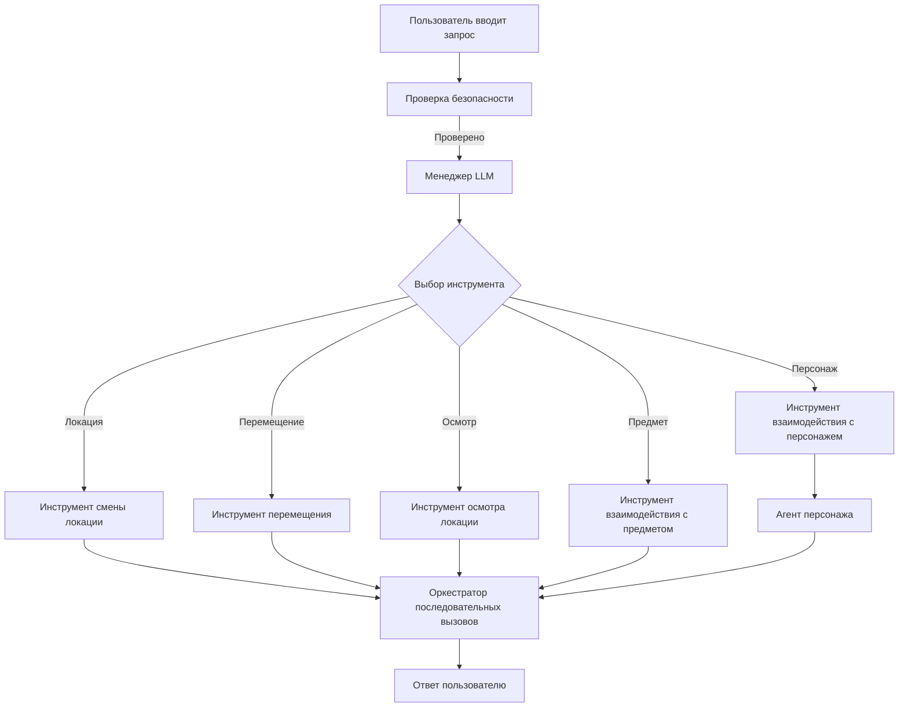

# llm_toolkit-lightrag
Combinations of LLM tools with LightRAG and system hosting

Вот описание и названия функций на русском языке:

*   `_add_locations(locations)`: Добавляет новые локации.
*   `_add_items(items)`: Добавляет новые предметы.
*   `get_location_details(name)`:  Получает детали конкретной локации.
*   `get_location_details_by_id(id)`: Получает детали конкретной локации по ID.
*   `get_item_details(id)`: Получает детали конкретного предмета.
*   `get_items_in_location(location_name)`: Получает все предметы в конкретной локации.
*   `get_object_enviroment(id)`: Получает окружение конкретного объекта.
*   `change_object_location(object_id, location_id)`: Изменяет местоположение конкретного объекта.
*   `move_player_to_location(player_id, location_id)`: Перемещает игрока в конкретную локацию.
*   `_add_player(player_name)`: Добавляет нового игрока.
*   `_remove_player(player_id)`: Удаляет игрока.
*   `move_character_to_location(character_id, location_id)`: Перемещает персонажа в конкретную локацию.
*   `_add_character(character_name)`: Добавляет нового персонажа.
*   `_remove_character(character_id)`: Удаляет персонажа.
*   `get_player_inventory(player_id)`: Получает инвентарь игрока.
*   `search_object(location_name, object_name)`: Ищет объект в локации (используется случайный результат).