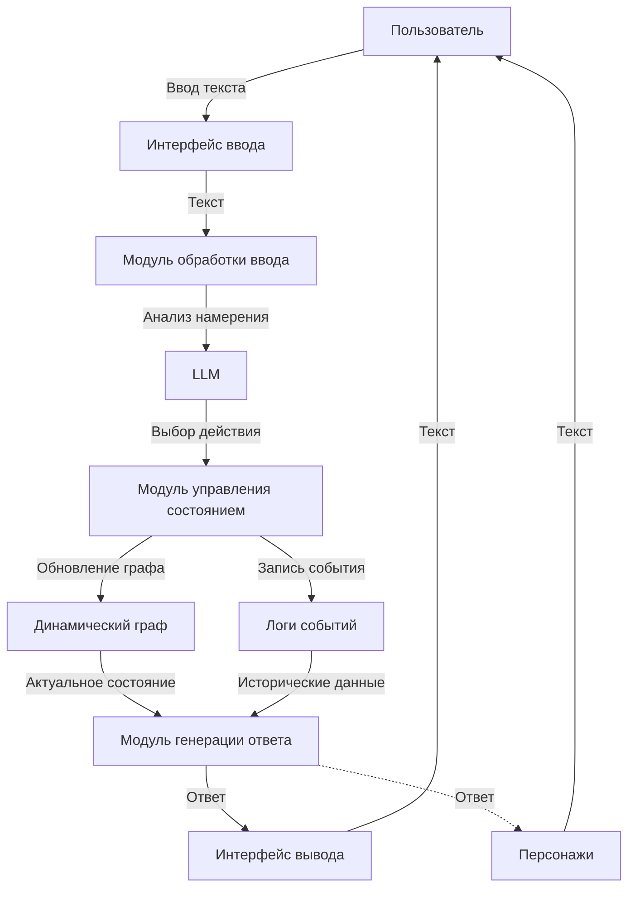
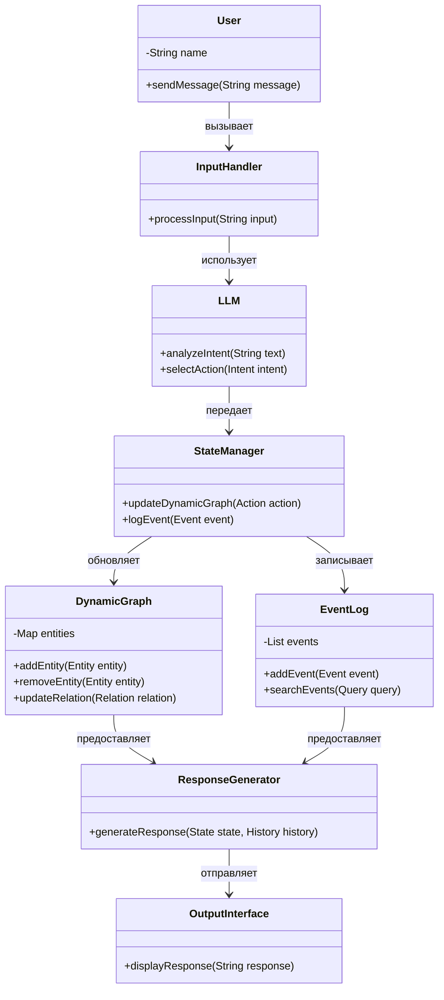
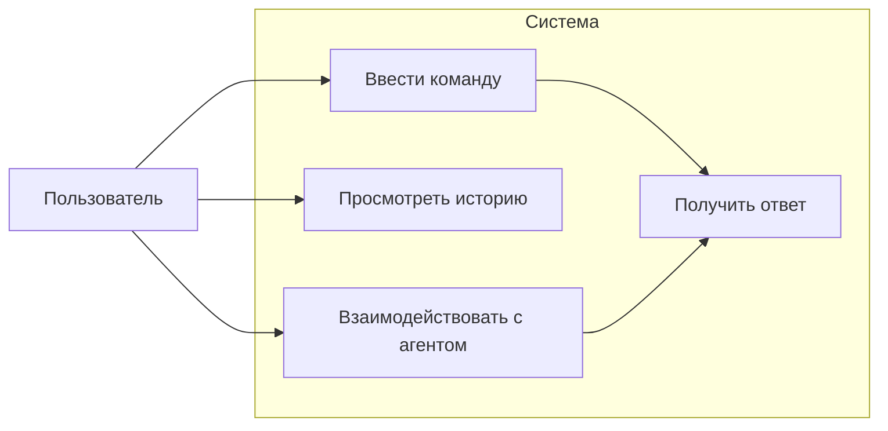
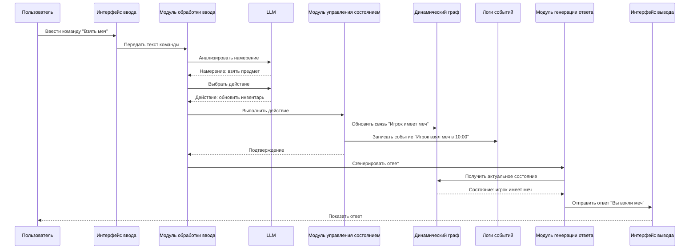

# Диаграммы системы
---

**Данные диаграммы корректны только для начальной стадии**

---
## 1. Диаграмма потоков данных (Data Flow Diagram)

Эта диаграмма показывает, как данные перемещаются через систему: от ввода пользователя до обработки, управления состоянием и генерации ответа.

**Описание:**
- Пользователь вводит текст через интерфейс ввода.
- Модуль обработки ввода передает текст в LLM для анализа намерения и выбора действия.
- Модуль управления состоянием обновляет динамический граф и записывает события в логи.
- Модуль генерации ответа использует данные из графа и логов для формирования ответа, который возвращается пользователю через интерфейс вывода.

## 2. Диаграмма классов (Class Diagram)

Эта диаграмма отображает основные классы системы и их взаимосвязи в стандартной UML-нотации, показывая структуру системы.

**Описание:**
- User отправляет сообщения через InputHandler.
- InputHandler обрабатывает ввод и передает его в LLM для анализа и выбора действий.
- StateManager управляет состоянием, обновляя DynamicGraph и записывая события в EventLog.
- ResponseGenerator формирует ответ, используя данные из DynamicGraph и EventLog, и передает его в OutputInterface.

## 3. Диаграмма вариантов использования (Use Case Diagram)

Эта диаграмма демонстрирует основные сценарии использования системы с точки зрения пользователя в стандартной UML-нотации.

**Описание:**
- Пользователь может:
  - Вводить команды и получать ответы.
  - Просматривать историю событий.
  - Взаимодействовать с агентом, что также приводит к генерации ответа.
- Основные действия связаны с вводом команд и взаимодействием, которые завершаются получением ответа.

## 4. Диаграмма последовательности (Sequence Diagram)

Эта диаграмма иллюстрирует последовательность взаимодействий между компонентами системы при выполнении команды, например, "Взять меч", в стандартной UML-нотации.

**Описание:**
- Пользователь вводит команду через интерфейс ввода.
- Модуль обработки ввода анализирует текст с помощью LLM, определяет намерение и действие.
- Модуль управления состоянием обновляет граф и логирует событие.
- Модуль генерации ответа формирует ответ на основе актуального состояния и отправляет его пользователю через интерфейс вывода.

## Итог

Эти четыре диаграммы в формате Mermaid представляют систему в стандартных нотациях:
- Диаграмма потоков данных — движение информации.
- Диаграмма классов — структура и взаимосвязи компонентов.
- Диаграмма вариантов использования — функциональные возможности для пользователя.
- Диаграмма последовательности — динамика взаимодействия компонентов.

