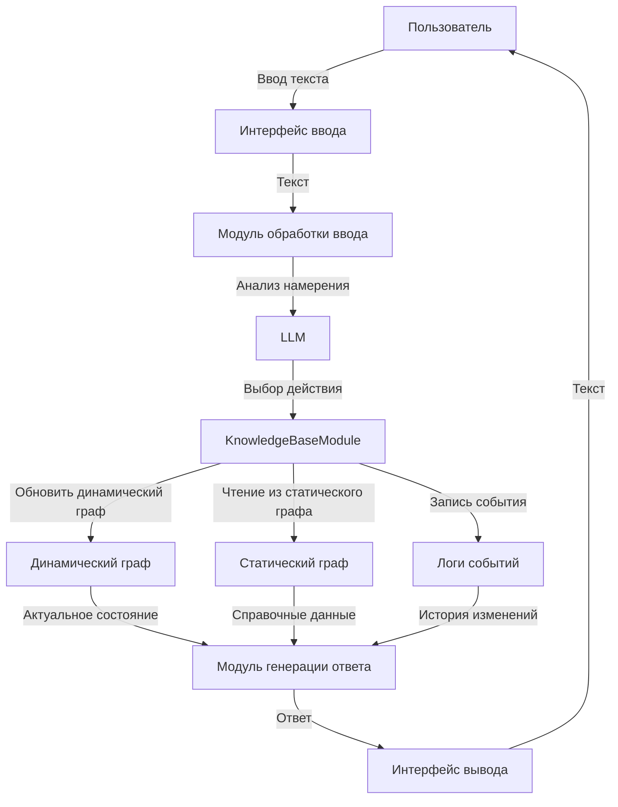
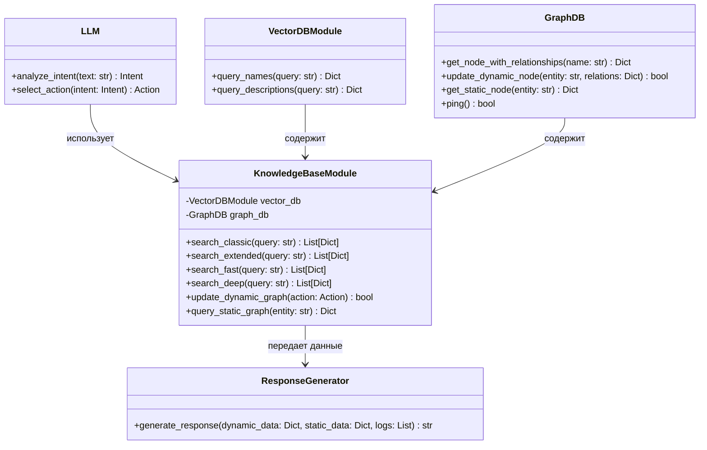
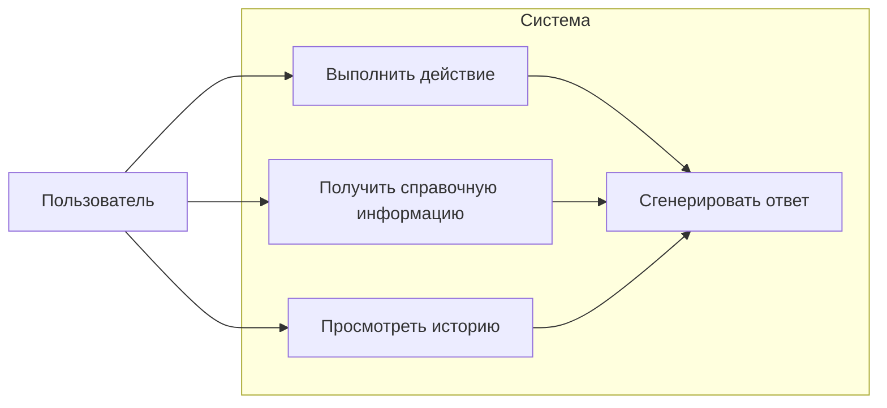
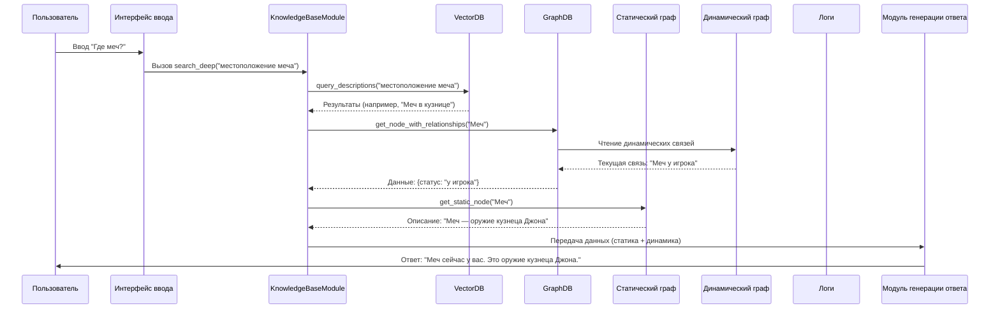

# Системные диаграммы

## 1. Диаграмма потоков данных (Data Flow Diagram)

**Описание:**  
- **Статический граф** содержит неизменяемые данные о мире (например, "Меч — оружие кузнеца Джона").
- **Динамический граф** хранит текущее состояние (например, "Игрок имеет меч").
- **Логи событий** сохраняют историю изменений с временными метками.
- **KnowledgeBaseModule** управляет взаимодействием между всеми компонентами.

---

## 2. Диаграмма классов (Class Diagram)

**Описание:**  
- **KnowledgeBaseModule** интегрирует векторную БД (ChromaDB), графовую БД (Neo4j) и логи.
- **GraphDB** поддерживает методы для работы с **статическим** (справочные данные) и **динамическим** графом (изменяемые состояния).
- **ResponseGenerator** формирует ответы на основе данных из всех источников.

---

## 3. Диаграмма вариантов использования (Use Case Diagram)

**Описание:**  
- Пользователь может:
  - Выполнять действия (например, "Взять меч"), обновляющие динамический граф.
  - Запрашивать справочные данные из статического графа.
  - Просматривать историю изменений через логи.
  - Получать ответы, объединяющие данные из всех компонентов.

---

## 4. Диаграмма последовательности (Sequence Diagram)

**Описание:**  
- Поиск информации о местоположении меча:
  - **Векторная БД** находит описание "Меч в кузнице".
  - **Динамический граф** показывает, что меч сейчас у игрока.
  - **Статический граф** предоставляет описание меча.
  - Ответ объединяет актуальное состояние и справочные данные.

---

## Итог
Диаграммы отражают полную систему с:
1. **Статическим графом** — неизменяемые данные.
2. **Динамическим графом** — текущее состояние мира.
3. **Логами** — история изменений.
4. **KnowledgeBaseModule** — центральный компонент для интеграции данных и генерации ответов.
